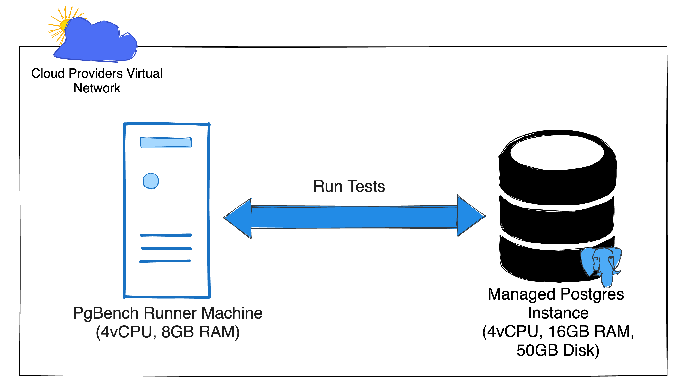

I've been working with cloud databases for a few years now, and I've always been impressed with the performance of PostgreSQL. However, I recently had an experience that made me question whether all cloud providers are created equal. I was working on a project that required a lot of concurrent database queries, and I was using CloudSQL (GCP's managed PostgreSQL instance). I noticed that the performance of my queries could have been better than I expected.  I had to tune some parameters to get better performance (I'll write about this later), but this got me thinking. What if the performance of CloudSQL was just a fluke, or was it similar across other Cloud Providers? 

So, I decided to run a benchmark test to compare the essential performance of managed PostgreSQL instances provided by various Cloud Providers. In this article, I will share the results of my tests. I hope this article will provide additional points to consider when deciding on a cloud database provider.

## The Setup
I intended to run a simple benchmark test that mirrors what the average users starting with Postgres would run into. The aim of my test was not to benchmark the performance of Postgres; no, there are loads of tests for that online.

### First, the Machines
I opted to use [pgbench](https://www.postgresql.org/docs/current/pgbench.html) because it provided an easy way to generate transactions and test the relative throughput. Next was to provision the databases and run pgbench on them. To make the results more fair, I set up the machines (runners) running pgbench within the cloud provider and have put them on the same network as the Postgres instances. This should mirror the standard way people interact with these databases and ensure that the tests are fair across the various database providers.

The specification for the machines used across the service providers:
<table>
	<tr>
		<th>Database Instance</th>
		<td>4 vCPU, 16GB RAM, 50GB Storage</td>
	</tr>
	<tr>
		<th>Runner Instance</th>
		<td>4 vCPU, 8GB RAM</td>
	</tr>
</table>

### Next, the Load
Pgbench provides a couple of configuration parameters to vary the type of load it generates when running the benchmark. After several experiments, I finally ran these tests with the following configuration.
<table>
	<tr>
		<th>Number of Clients</th>
		<td>from <strong>2</strong> to <strong>10</strong></td>
	</tr>
	<tr>
		<th>Transactions per Client</th>
		<td>100</td>
</table>

This configuration means the tests will execute between **200** and **1000** [transactions](https://www.postgresql.org/docs/current/pgbench.html#:~:text=Notes-,What%20Is%20the%20%E2%80%9CTransaction%E2%80%9D%20Actually%20Performed%20in%20pgbench%3F,-pgbench%20executes%20test) concurrently (load distributed across four threads).

Now with all that set. I ran the test multiple times and collated the results in a CSV.

## The Result
I've only run the tests on the following platforms: [Amazon Web Services](https://aws.amazon.com/) (AWS), [Google Cloud Platform](https://cloud.google.com/) (GCP) and [Digitalocean](https://digitalocean.com/) (DO). I'll run on Azure, Heroku and Bare Metal next (subscribe to be notified of those results).

Without further ado, below is a chart of the processing rate as the number of transactions increased.

And we have a winner. AWS outperforms the others, with DO coming in second place. The performance of GCP and DO are close too.

### Plot twist
AWS is not the clear winner 😅; while running the tests repeatedly, I noticed that GCP and DO gave consistent results, but AWS's performance varied largely, and after some investigation, it seems AWS does performance burst on its instances (even though I'm not using burstable nodes). So the results above represent peak values for AWS. I needed to exceed the CPU boost allowance for AWS, and after running exhausting that, the results look like this:

// TODO: Insert graphs for results here.

The results have now been skewed, and AWS performs lower than GCP and DO.

## Concluding Thoughts
As expected, the Transaction Processing Rate (TPS) increases as the load increases, which is what I intended, I'm not interested in stress testing the instance but only to get how fast each database instance processes transactions when under normal conditions.

In this test, Digitalocean's Managed Postgres Database came out as the consistently performant database, with AWS having the advantage of occasional bursty performance.

You can consider other factors to improve your instances' performance. For instance, many of these cloud providers allow you to configure Postgres performance, and these usually come in handy when you are familiar with the workload your application deals with. **But the Performance of the default configurations should be plenty enough for small to medium sizes applications (which is another subtle point I'm trying to prove with this post).**

If you want to run the tests, the code is Open Source on my [PerfectsEngineering/loadtesting-cloud-pg](https://github.com/PerfectsEngineering/loadtesting-cloud-pg) repository. Follow the instructions in the Readme to run them for yourself.

Next up, I'll run the tests on Azure and Heroku's PostgreSQL instances and bring everything to full Circle by running a similar test on a bare-metal server. Subscribe to know when that post goes live, and do let me know in the comment if there are other Database providers you would like me to consider as well.

