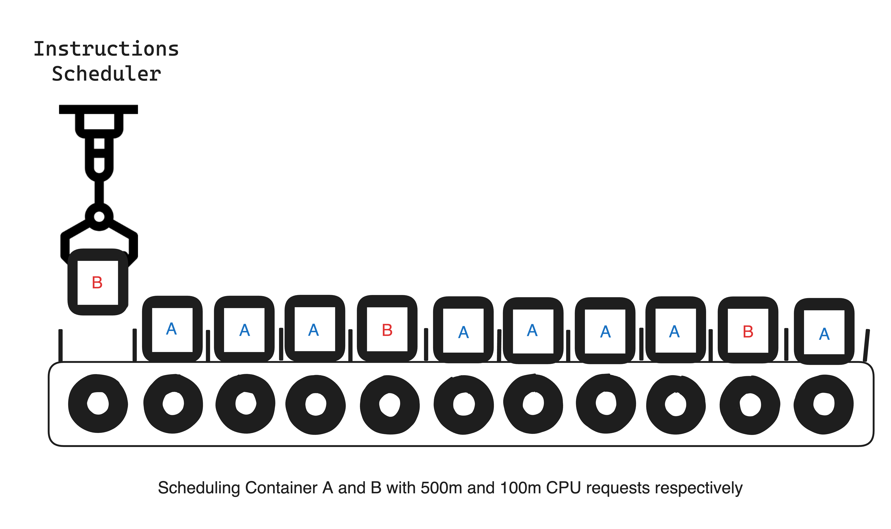

In today's fast-paced world of application development, containerisation and orchestration have become crucial components for deploying and managing modern applications. Kubernetes, a widely-used container orchestration platform, has made it easier for developers and system administrators to manage containerised applications' deployment, scaling, and operation. One of the critical aspects of Kubernetes is its ability to manage resources such as CPU and memory.

A colleague recently asked me if it was possible for a multi-threaded application to run on a container granted less than 1 vCPU resource limit. **The short answer is yes**, it is possible. In this blog post, I will explain how Kubernetes CPU resource allocation works, specifically focusing on how it can request less than one vCPU and still have your application run multi-threaded.

## First, the Basics of Kubernetes CPU Resource Allocation

Kubernetes allows users to specify the CPU resources a container requires in terms of "**request**" and "**limit**". A "**request**" is the minimum amount of CPU a container is guaranteed to have, while the "limit" is the maximum CPU a container can use. These values are specified in the container's YAML configuration file, and they help Kubernetes in making informed decisions while scheduling and allocating resources to different containers running on the same node.

CPU resources are measured in vCPUs and CPU units. A vCPU represents a virtual CPU core corresponding to a physical CPU core or a hyperthread on the underlying hardware. On the other hand, CPU units are a more granular measurement - often represented in millicores. One vCPU is equivalent to 1000 millicores. This granularity enables Kubernetes to allocate CPU resources more efficiently, allowing containers to request and consume CPU resources in fractions of a vCPU.

This is typically specified as part of a Pods Manifest file like so:

```yaml
---
resources:
    requests:
        cpu: 50m
    limits:
        cpu: 100m
```

The above means the container can use at least 5% (50/1000) of a CPU cycle and at most 10% of a CPU cycle.

## Thinking about CPU Cycles
Imagine a CPU as a conveyor belt. The conveyor belt is divided into small sections, each representing a CPU cycle. The rate at which the conveyor belt moves is the CPU clock speed (representing a **Period**).


When a thread is scheduled to run, it is given several sections on the conveyor belt. The threads instructions can only run while it is on the conveyor belt. If a thread needs to perform many calculations, it must be allocated more sections on the conveyor belt. This will allow the thread to run for a more extended time and do more work.

If a thread is not using all of its allocated sections, the CPU scheduler can give those sections to other threads that need them. This ensures that all of the threads can run as efficiently as possible.

## Now, Kubernetes CPU Requests & Limits

The CPU `requests` parameter ensures the container can use **at least** the specified number of cores requested. 

You can visualise this as each container is given as many sections on the conveyor belt as they need to run their instructions. For example, think of 1vCPU as the conveyor belt having ten sections, and if we have two containers, A and B, Container A requests 500m, and Container B requests 100m.


The problem with simply specifying `requests`, at least with how Kubernetes handles it, is that it **only ensures the minimum requested CPU share is granted**. Continuing the illustration, the Scheduler will want to continue scheduling Container instructions for the remaining sections as long as the minimum `requests` are always met.




Notice that eventually, Container A is using up way more Cycles that could have been given to Container B. This is because Kubernetes doesn't prevent the container from using more CPU time than it has requested. And this is why the CPU `limits` parameter was introduced. 

CPU `limits` use a different mechanism to ensure that a container can only use as many CPU cycles as specified. If the limit is reached, the container gets throttled, and none of its instructions is scheduled for some time. 

To achieve this, the container runtime calculates how long a container can use the CPU time (called a **quota**) within a period based on the `limits` value provided. It then ensures that the container is scheduled no more than its limit within that period.


> Another way to think of this is to express the requested limit as a fraction of the time of a single available CPU. So, for example, given a limit of `100m`, we are requesting 100/1000 of a CPU cycle.
> 
> Expressing this as CPU time where a complete cycle is 1000ms will mean the container can only use 10ms (quota) for every 100ms(period) of CPU time. This also applies when more than one 1vCPU limit is specified, like `1500m`. The quota will span multiple **periods**, so the container can only use 150ms for every 200ms CPU time.

## How do Containers recover from Interruptions?
You may have noticed that when Instructions are scheduled, a particular thread or container will have moments of pauses when its instruction is not actively running. This is even more likely when many Containers or Processes are contending for CPU cycles. 

Instructions are usually split up into smaller units to ensure that operations can be interrupted and resumed. This allows the CPU to keep the state of the last instruction so that it can be resumed when the next instruction is scheduled.

## Now to Answer the Question about Multi-threading on a single vCPU

Let's take a look at this sample rust code that spins up two threads:
```rust
...
// create two threads and wait for them to finish
let handle1 = thread::spawn(|| {
	println!("Hello from thread 1: {}", i);
});
let handle2 = thread::spawn(|| {
	println!("Hello from thread 2: {}", i);
});
handle1.join().unwrap();
handle2.join().unwrap();
```

When compiling, each of these threads is compiled into its own set of instructions, and they are scheduled to the CPUs available to the program. If we have multiple CPUs available, then the straightforward execution plan would be to schedule each thread's instructions on separate CPUs to ensure they are run in parallel. However, this is different from how Instructions get scheduled in reality. Instead, they are broken down into specific instructions, which are multiplexed across as many CPUs as possible.

So, if we give this program less than 1vCPU (`500m`, for example) when running in a container, the two threads' instructions will be broken up and interwoven to run as fast as possible.

> This is a follow-up from a Livestream where I walk through a practical explanation of this article. If you prefer visual learning, you can watch that: 
>
> <iframe width="560" height="315" src="https://www.youtube.com/embed/NZiFTUt_AsQ" title="YouTube video player" frameborder="0" allow="accelerometer; autoplay; clipboard-write; encrypted-media; gyroscope; picture-in-picture; web-share" allowfullscreen></iframe>
>
> Github Repository: [PerfectsEngineering/k8s_cpu_limits ](https://github.com/PerfectsEngineering/k8s_cpu_limits/blob/master/src/README.md)


## Benefits of Requesting Less Than One vCPU

There are a few benefits of requesting less than 1vCPU in Kubernetes pods:

- **Reduced cost:** Kubernetes nodes are typically provisioned with multiple CPU cores. If you request less than 1vCPU for your pods, you will only be charged for the fraction of a core that you use. This can save you money, especially if you are running a large number of pods.
- **Improved scalability:** By requesting less than 1vCPU, you can scale your application more easily. If you need to increase the number of pods running, you can do so without having to increase the number of CPU cores on your nodes. This can help you to avoid running out of resources and improve the performance of your application.
- **Improved availability:** By requesting less than 1vCPU, you can improve the availability of your application. If one node fails, your pods will be able to be rescheduled on other nodes without having to be scaled down. This can help to ensure that your application is always available to users.

## Considerations when requesting vCPU Resources

Of course, there are also some ***potential drawbacks*** to requesting less than 1vCPU. For example, your pods may not be able to achieve the same level of performance as pods that request more CPU. Here are some additional things to consider when deciding how much CPU to request for your Kubernetes pods:

- The type of application you are running. Some applications are more CPU-intensive than others.
- The number of pods you are running. The more pods you run, the more CPU you will need.
- The resources available on your Kubernetes cluster. If you have a limited number of CPU cores, you may need to request less CPU for your pods.

Ultimately, the best way to determine how much CPU to request for your Kubernetes pods is to experiment and see what works best for your application.

## Conclusion

In summary, Kubernetes offers a flexible and efficient way of managing CPU resources for containerized applications. By allowing users to specify CPU requests in millicores, it becomes possible to request less than 1 vCPU and still run multi-threaded applications. This flexibility benefits both the performance of individual applications and the overall resource utilisation on the node. By understanding and leveraging Kubernetes' CPU resource allocation features, you can optimize your application deployments and ensure that your applications run smoothly and efficiently in a multi-container environment.

I tried to simplify the explanations in this article, and if you are interested in more technical details of how this CPU requests and quota systems work, I recommend you read this article on [Understanding resource limits in kubernetes: cpu time](https://medium.com/@betz.mark/understanding-resource-limits-in-kubernetes-cpu-time-9eff74d3161b) by Mark Betz . It's a really good one.