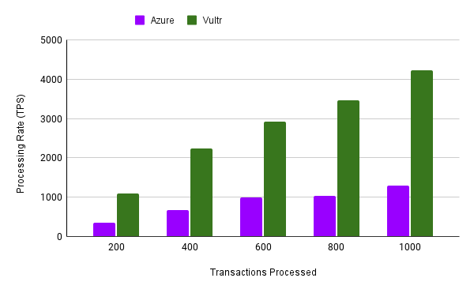
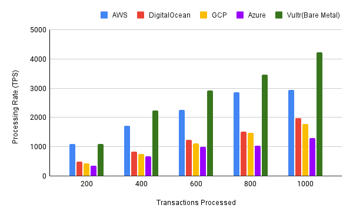

This article is a follow-up to a previous article that <a href="./cloud_postgres_performance_1" target="_blank">compares the performance of managed Postgres database from AWS, GCP and Digitalocean</a>. You should read that first to understand the setup for the machine and the tests I'm running.

In this article, I'll share the results of running the pgbench tests against Microsoft [Azure's Managed Postgres](https://learn.microsoft.com/en-us/azure/postgresql/flexible-server/overview) Instance and a Bare Metal Machine. Finding a Bare Metal Machine with the right specs was hard, but I finally found one with [Vultr](https://www.vultr.com/), so I used their Machine for this test. In my previous post, I mentioned I'd also be running these tests on Heroku's Postgres Instance. Still, I did not do that 😅 mainly because Heroku uses AWS machines under the hood, and the results seemed similar to the AWS results from the first part of this article.

## Now, the results:

Here is the chart of the processing rates from running the tests on Azure and Vultr's Bare Metal Machine:

And putting them together with the other providers I ran in my previous article:

The Bare Metal Machine is the clear winner in terms of performance. This is unsurprising as Bare Metal Machines, by definition, grant unshared access to the full capacity of a server's CPU and RAM storage. In contrast, Virtual Servers from other providers require their hardware resources to be allocated amongst numerous tenants. Additionally, the virtualization software these providers utilise can introduce overhead, further exacerbating the performance disparity.

### Approximate cost of each Provider/Machine
Before writing my conclusions, I also want to share some approximate monthly costs of operating these machines. 

|   |   |   |
|---|---|---|
||**Machine Details**|**Minimum Cost per Month ($)**|
|**AWS**|db.m5.xlarge (4vCPU, 16GB RAM), 50GB SSD|**245**|
|**DigitalOcean**|gd-4vcpu-16g (4vCPU, 16GB RAM, 70GB SSD)|**230**|
|**GCP**|- db-custom-4-16384 (4vCPU, 16GB RAM), 50GB SSD|**210.86**|
|**Azure**|- GP_Standard_D4ds_v4 (4vCPU, 20.8GB RAM), 64 GB SSD|**267.24**|
|**Vultr** (Bare Metal)|- vbm-4c-32gb (4 CPU, 32GB RAM, 280GB SSD)|**120**|

It is essential to realise that my approximation of monthly costs only covers single-machine setups. Additional features and expenses, such as Bandwidth, Backups, Replication, etc., would apply in a real-world production scenario.

## Conclusion
The Bare Metal Machine emerged as the definite victor in terms of performance. However, performance is only one metric that should influence your decision when choosing a cloud provider or machine for running Postgres. The costs associated with operating these machines should be noted. Even though the Bare Metal Machine appears to be the cheapest option, It is important to remember that Bare Metal Machines are not managed and would require some significant expertise and skill to maintain compared to the other providers.

A successful decision will come from balancing performance and cost while considering a provider's capabilities, reliability, and additional service offerings. Also, remember that performance can be considerably tweaked with software optimisations like indexes, data type choices, query designs, etc.

The best cloud service provider or machine for your Postgres databases will heavily depend on your specific needs, budget and long-term plans. Nonetheless, comparative analysis like I have performed here can aid greatly in your process of picking the most suited option for your applications.

> You can re-run these tests for yourself. The code for running them is available on my [PerfectsEngineering Repository](https://github.com/perfectsengineering/loadtesting-cloud-pg).