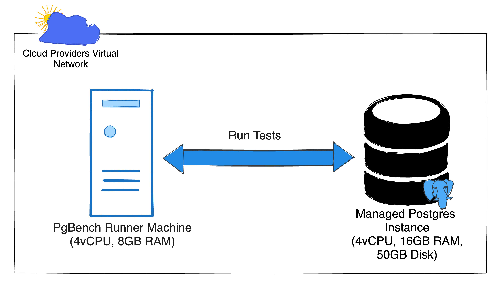

I recently ran tests to benchmark the performance of Postgres databases offered by various Cloud Providers. The overall steps of running a test were:
- Create an Account on the Cloud Providers Platform.
- Provision the required Postgres Instance. 
- Provision the Runner Machine responsible for running the `pgbench` command against the instance.
- Login to the Runner Machine, run the various `pgbench` commands and collate the results.
The above steps were to be repeated for each of the six providers I had planned to run the benchmarks for 😅. I immediately knew the best approach to doing this was to automate as many steps as possible.

In this post, I'll share how I used **Terraform** and **Ansible** to run my <a href="/cloud_postgres_performance_1" target="_blank">Postgres Performance tests</a>. **Terraform** and **Ansible** are two powerful tools for managing infrastructure and automating configuration. They make it easy to generate efficient, scalable, and repeatable infrastructures.

> **TLDR;** I used **Terraform** to provision the Postgres Instances across each environment and **Ansible** to automate the running of pgbench on the test-running server. You can see the [final code on Github](https://github.com/perfectsengineering/loadtesting-cloud-pg). Read on for the full gist.
## What are Terraform and Ansible?
 
Terraform is a tool owned by HashiCorp, to automatically manage (create, update and delete) resources in a platform. For example, it can be used to create and delete a Machine on AWS or provision in Google Cloud Storage Bucket on Google Cloud. If a cloud or infrastructure provider supports Terraform (which most of them do), then you can manage their resources with Terraform. You will use HashiCorp Configuration Language (HCL) to describe the final state of your infrastructure to Terraform, and it will go ahead and provision all the resources.

On the other hand, Ansible is an open-source tool that automates repetitive tasks (usually Machine/Server Configurations), reducing the chances of human mistakes. These tasks are written in YAML and provide powerful functionalities to manage even the most complex tasks.

Now, combining the infrastructure management ability of **Terraform** with the tasks running capabilities of **Ansible**, you may already see how they can help automate the steps I highlighted at the start of this article. Not to mention that they also provide the added advantage of versioning all my infrastructure and tasks, a practice commonly referred to as **Infrastructure as Code (IaC)**.

## Setting up the Infrastructure with Terraform


I will use AWS as a concrete example, but the concept can be extended to other providers. Now, I will describe my target architecture for AWS using HCL. First, I'll need to specify my provider of choice, in this case AWS:

### Terraform Providers
```hcl{numberLines: true}
terraform {
  required_version = ">= 1.5.0"
  required_providers {
    aws = {
      source  = "hashicorp/aws"
    }
  }
}

provider "aws" {
  region = "eu-west-2"
}
```

These tell Terraform we need the `aws` provider runtime logic to be downloaded and installed. It also configures the provider's region to `eu-west-2`, so any resource created will be in that AWS region. 

### Provision the Database
Next, I want to create a Postgres instance. This can be done like so:
```hcl{numberLines: true}
resource "aws_db_instance" "postgres" {
  allocated_storage    = 50
  db_name              = "loadtest"
  engine               = "postgres"
  engine_version       = "15.2"
  instance_class       = "db.m5.xlarge" # 4 CPU, 16GB RAM
  identifier_prefix    = "loadtest-db"  
  username             = "loadtest_user"
  password             = "random_db_password_23"
  skip_final_snapshot  = true # ensure we can delete quickly
}

output "db_host" {
    value = aws_db_instance.postgres.address
}

output "db_port" {
    value = aws_db_instance.postgres.port
}
```
The `output` type informs Terraform to extract the address and port of the Postgres instances after it is created and make it available via the `db_host` and `db_port` names, respectively. This will be used to connect to the Postgres instances when running the pgbench tests.

### Provisioning the Runner Machine
Finally, I need a Runner that I can SSH into to run `pgbench`:
```hcl{numberLines: true}
resource "aws_key_pair" "default" {
  key_name   = "loadtest-ssh-key"
  # modify this path for your computers directory
  public_key = file("/path/to/my/computers/ssh_public_key")
}

resource "aws_instance" "runner" {
  ami           = "ami-059ddb696446729d4" # Ubuntu 22.04
  instance_type = "m5.xlarge" # 4vCPU, 16GB
  key_name = aws_key_pair.default.key_name
  tags = {
    Name = "LoadtestRunner"
  }
}

output "compute_public_ip" {
    value = aws_instance.runner.public_ip
}
```

### All together

<collapsible title="All the Code together">

```hcl{numberLines: true}
# terraform.tf file
terraform {
  required_version = ">= 1.5.0"
  required_providers {
    aws = {
      source  = "hashicorp/aws"
    }
  }
}

provider "aws" {
  region = "eu-west-2"
}

resource "aws_db_instance" "postgres" {
  allocated_storage    = 50
  db_name              = "loadtest"
  engine               = "postgres"
  engine_version       = "15.2"
  instance_class       = "db.m5.xlarge" # 4 CPU, 16GB RAM
  identifier_prefix    = "loadtest-db"  
  username             = "loadtest_user"
  password             = "random_db_password_23"
  skip_final_snapshot  = true # ensure we can delete quickly
}

output "db_host" {
    value = aws_db_instance.postgres.address
}

output "db_port" {
    value = aws_db_instance.postgres.port
}

resource "aws_key_pair" "default" {
  key_name   = "loadtest-ssh-key"
  public_key = file("/path/to/my/computers/ssh_public_key")
}

resource "aws_instance" "runner" {
  ami           = "ami-059ddb696446729d4" # Ubuntu 22.04
  instance_type = "m5.xlarge" # 4vCPU, 16GB
  key_name = aws_key_pair.default.key_name
  tags = {
    Name = "LoadtestRunner"
  }
}

output "compute_public_ip" {
    value = aws_instance.runner.public_ip
}
```
</collapsible>

&nbsp;
>To use Terraform, you'll need to install the `terraform` CLI tool on your computer and also follow the relevant instructions to get authenticated on the Cloud Provider you are trying to manage their infrastructure. Instructions for AWS can be found [here](https://developer.hashicorp.com/terraform/tutorials/aws-get-started/install-cli).

With these, I can run the `terraform apply` command in the same directory as the configuration file, and Terraform will create all the infrastructure described (in the correct order, too). Also, You can run `terraform output` to see all your configuration's output values.

When done, I can `terraform destroy`, and Terraform will destroy all provisioned infrastructure for me.

Now that I can easily create, modify and destroy my infrastructure, I actually need to run the tests from the Runner Machine.
## Running the Tests with Ansible
Ansible comes into play to ensure consistent machine configuration across multiple runs, helping me to maintain a similar testing environment every time. 

### Inventory of Hosts
Ansible requires an inventory file containing the addresses of the machines we want to run our tasks on. This file can either be in INI or YAML format. I prefer the INI format for simplicity. The file contains the addresses in its simplest state, each on a single line.
```ini{numberLines: true}
server1_address.com
123.0.0.1
```
You can put as many addresses (both domains or IP addresses) in this file as you want, so long we can SSH into them from our computer; Ansible will run our defined tasks on those machines.

Following my example above, I'll need to SSH into my runner machine and run pgbench against the database instance. You can get your runner machine's IP address by running `terraform output compute_public_ip`. Go ahead and put **that in a file named `hosts`**. We will reference that file later.

### Description of Tasks
Next, you'll want to define the tasks. Ansible allows grouping a set of tasks into what it calls a '**Play**'. Then a group of these Plays is considered a Playbook.

First, we want to run a group of tasks to update the system and install our required dependency. The system update is generally advised, especially if you are trying to install some software that may not exist on the machine's base image. In our case, we want to install the `postgresql` package, so that `pgbench` becomes available.

```yaml{numberLines: true}
---
- name: Setup server and dependencies
  hosts: all
  become: true
  tasks:
    - name: Run the equivalent of "apt get update" as a separate step
      ansible.builtin.apt:
        update_cache: yes
    - name: Install Postgres dependency
      ansible.builtin.apt:
        pkg:
          - postgresql
          - postgresql-contrib
```
These tasks use the built-in ansible modules `ansible.builtin.apt` which makes it easy to invoke commands on the Ubuntu `apt` package manager tool.

Next, we want to run the pgbench command. You should take a look at the <a href="https://www.postgresql.org/docs/current/pgbench.html" target="_blank">pgbench documentation</a> to understand better how it works, but we want `pgbench` to do two things:

1. Prepare the dataset required to run the load tests. 
2. Run the tests and return and output

These actions can be described as Ansible tasks like these:
```yaml{numberLines: true}
- name: Run the test
  hosts: all
  environment:
    PGPASSWORD: "random_db_password_23"
  tasks:
    - name: Prepare data set
      ansible.builtin.shell: |
        pgbench -h {{ db_host }} -p {{ db_port }} -U loadtest_user \
        -i --scale=100 --quiet loadtest
    - name: Run the test
      register: pgbench_output
      ansible.builtin.shell: |
        pgbench -h {{ db_host }} -p {{ db_port }} -U loadtest_user \
        --client=2 --jobs=4 \
        --transactions=100 loadtest
```
These tasks use the built-in ansible module `ansible.builtin.shell`. This allows you to run shell commands on the remote runner machine. In the above code, we execute the `pgbench` commands required for the two steps we needed. 

> You can get the `{{ db_host }}` and `{{ db_port }}` values using the `terraform output` command.

### All together

<collapsible title="All the Ansible task.yaml together">

```yaml{numberLines: true}
---
- name: Setup server and dependencies
  hosts: all
  become: true
  tasks:
    - name: Run the equivalent of "apt-get update" as a separate step
      ansible.builtin.apt:
        update_cache: yes
    - name: Install Postgres dependency
      ansible.builtin.apt:
        pkg:
          - postgresql
          - postgresql-contrib

- name: Run the test
  hosts: all
  environment:
    PGPASSWORD: "random_db_password_23"
  tasks:
    - name: Prepare data set
      ansible.builtin.shell: |
        pgbench -h {{ db_host }} -p {{ db_port }} -U loadtest_user \
        -i --scale=100 --quiet loadtest
    - name: Run the test
      register: pgbench_output
      ansible.builtin.shell: |
        pgbench -h {{ db_host }} -p {{ db_port }} -U loadtest_user \
        --client=2 --jobs=4 \
        --transactions=100 loadtest
```
</collapsible>

&nbsp;
> You'll need to install Ansible on your machine to run the `ansible` and `ansible-playbook` commands. Please follow the [installation instructions](https://docs.ansible.com/ansible/latest/installation_guide/intro_installation.html) in their documentation. 

If you are following along, you should have your `hosts` and `tasks.yml` file. Now, you can run tasks using the following command:
```sh
ansible-playbook -i hosts tasks.yml
```
If done right, you should see the output of each task we ran and, eventually, the output of the `pgbench` command.

Obviously, this is a simple way of doing this; with Ansible, you can do much more. For instance, you can generate adequately formatted reports of your output (my final implementation generated CSV files from the pgbench output).

## Why I choose Terraform and Ansible
There are many alternatives to Ansible, but two reasons why I prefer Ansible to many of the other alternatives  are:
1. It uses YAML, which is easier for me to learn, while the alternatives use some custom language.
2. It is simpler to run tasks because all I need is SSH access to the Machines I want to configure, while the alternatives require I install and configure some agent software on the Machines I want to configure.

As for Terraform, honestly, Terraform is one of the leading and oldest Infrastructure provisioning tools out there (and I have more experience using it 😂), so it was a no-brainer. Most alternatives are specific to a Cloud Provider (like AWS CDK) or don't support many Cloud Providers on my test list. 

> One alternative to Terraform I've heard good about is Pulumi. They also support all the Cloud Providers I was interested in. I plan to explore it more and maybe write a comparison of my experience using it. <a href="https://eepurl.com/gZ9xGj" target="_blank">Subscribe</a> to get notified when that happens.

## Concluding Thoughts
Load testing often requires a highly scalable environment that needs to be readily available and executed repeatedly. Rapid configurational changes and environment disposal often characterise these operations. Creating and managing such environments manually can introduce inconsistencies, inefficiencies, and potentially disastrous errors. The more automated the process, the easier it is to ensure everything works as it should in various conditions.

You can view the complete code I used to run my Github test [here](https://github.com/PerfectsEngineering/loadtesting-cloud-pg). I configured some additional networking rules in there. Take a look, and you will learn more from it, and let me know in the comments if you have any questions.

Whether a seasoned developer or a curious beginner, Terraform and Ansible are potent tools to enhance your infrastructure operations, with the rich capabilities of both Terraform and Ansible, it's high time we embraced and exploited this powerful combination to drive forward our load-testing efforts! You can get started with these tutorials:
- [Terraform Tutorial](https://developer.hashicorp.com/terraform/tutorials)
- [Ansible Tutorial](https://spacelift.io/blog/ansible-tutorial)

> I used Performance and Load Testing Interchangeably throughout this article, but they are not the same. You can read more about the difference in this [APIToolkit post about Testing](https://apitoolkit.io/blog/load-testing-vs-stress-testing-differences/).
