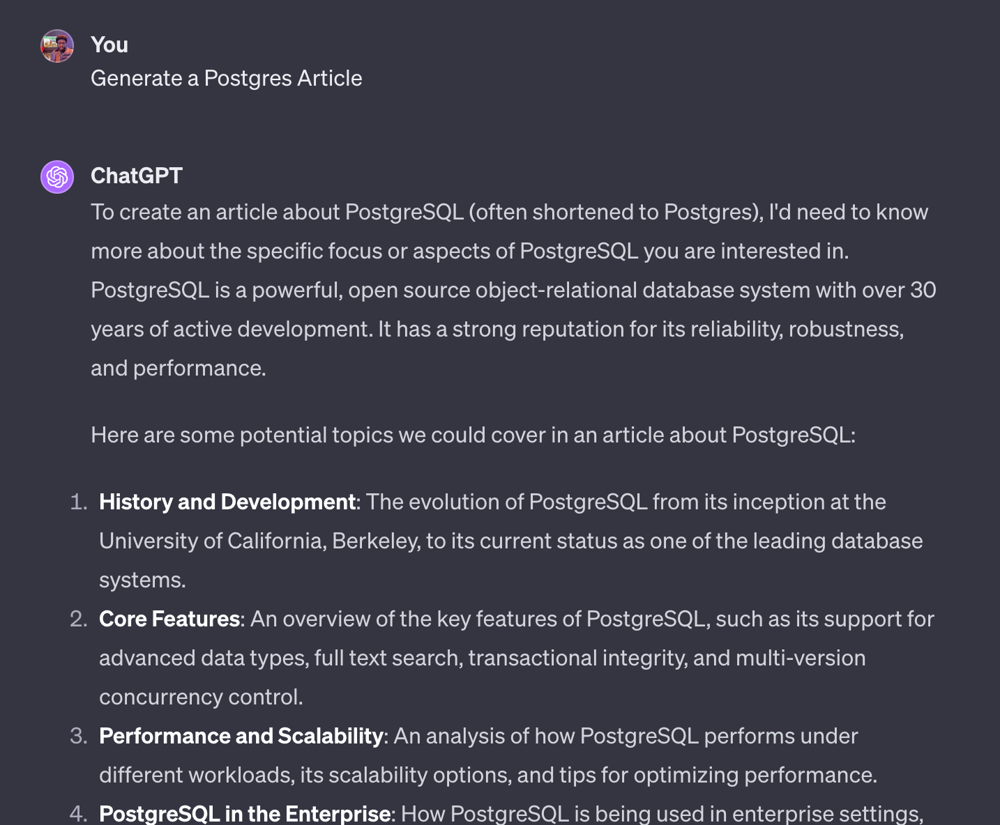
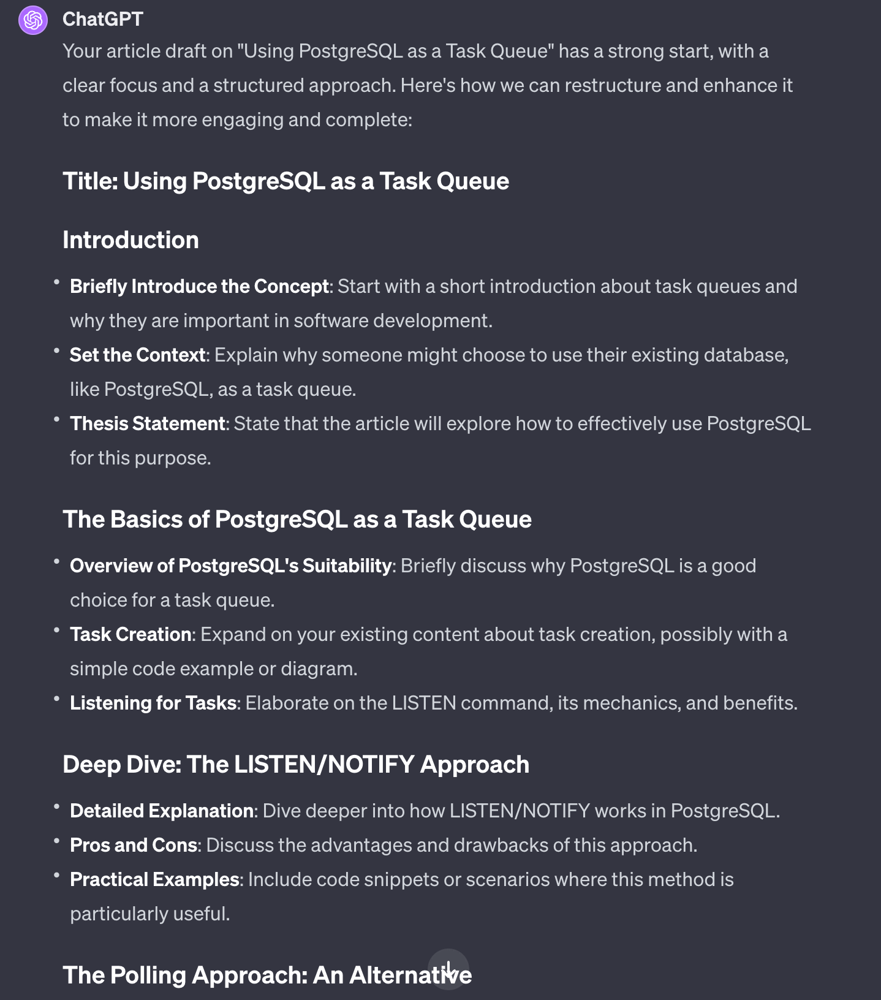
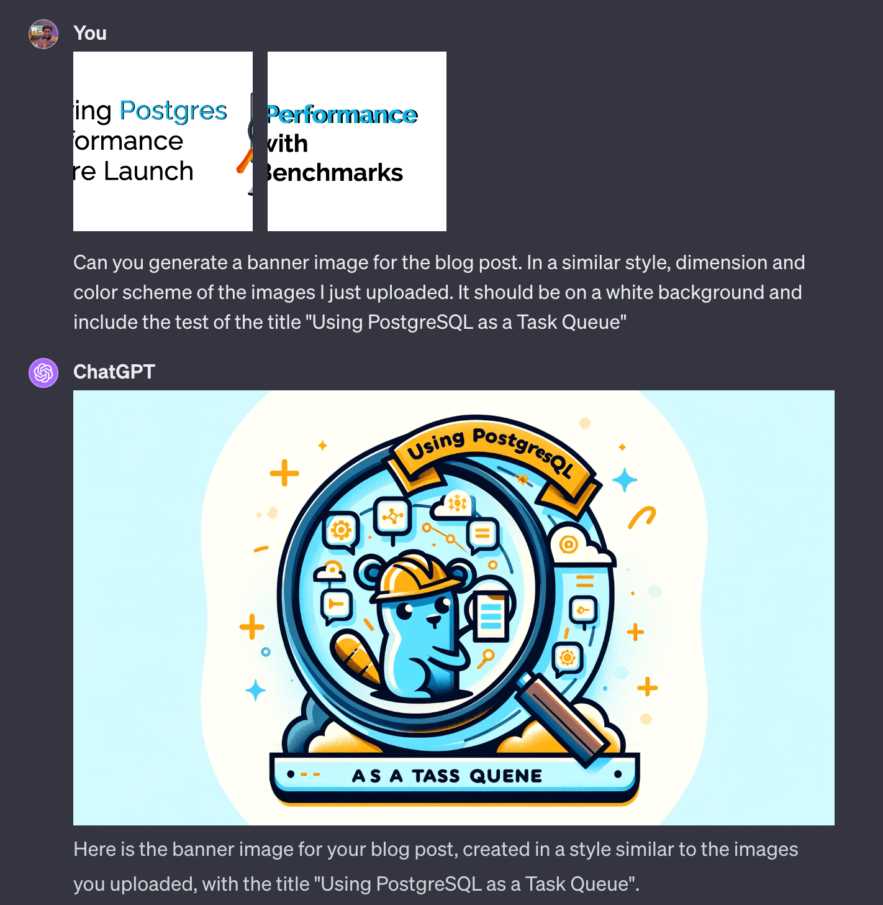

My last article on <a href="/using_postgres_as_task_queue" target="_blank">Using Postgresql as a Task Queue</a> was generated mainly by ChatGPT. If you still need to read it, I recommend you read it before proceeding with this post.

I do not intend to be using AI-generated content on this blog. I created this blog site to document my experience as a software engineer building tools and services. However, with the recent rise in GPT, I have been experimenting with various ways to leverage these AI models in my Engineering workflow. 

In this post, I will describe how I generated my last post using ChatGPT. 

> **What is GPT?** 
> 
> GPT stands for Generative Pre-training Transformer. It is a kind of artificial intelligence (AI) that understands and creates human language.
> 
> ChatGPT is a commercialized GPT AI model with many advanced capabilities provided by folks at [OpenAI](https://openai.com). 
## The Planning Process
For most GPT agents to work as expected, you need to give it instructions on what you need it to do (aka generate) for you. So, I could start by simply telling it to generate a Postgres Article, like so:



But, notice how it asks to clarify what type of article. This is because it needs as many details as possible to provide a better output relevant to what you want. This art of coming up with the proper Instructions is usually called "Prompt Engineering".

> To be honest, unless it is one of the more advanced GPT models, like ChatGPT 4.0, that I am using here, the GPT model might have generated a random article about Postgres and hallucinated some interesting content 😅.

So, I needed to come up with better instructions. Luckily, I already had a title for the article I wanted to write and a rough idea of what I wanted to share. This was an excellent place to start, so I wrote those down:

<div class="wrap-code">

```
In my experience, I've worked with a couple of task queuing and scheduling systems, each with different guarantees and trade-offs. But sometimes, when just starting, you want something simple, and most people opt for a solution that will use their existing infrastructure. One such case is using your current database system as your task queue, and then you have a separate worker process that polls the database whenever a new task exists to be processed.

As you may have guessed from the title, in this post, I will be focusing on Postgres (my relational database of choice) and sharing some interesting ways I've seen people build a task queue using features and guarantees provided by Postgres.

## Task Creation
TODO: Talk about writing records to a task table and using NOTIFY to publish it.

## Listening for Tasks
TODO: Talk about using LISTEN to trigger a task worker

## Task Processing
TODO: Talk about selectively locking your table using row-level locking and skipping locked ones.

## The polling approach:
TODO: Compare the benefits of using LISTEN/NOTIFY to polling for new database tasks.

# Conclusion
LISTEN/NOTIFY in Postgres offers a powerful yet straightforward approach to building real-time, efficient, scalable task queuing systems. Its integration into task queuing libraries can significantly improve the responsiveness and performance of applications, particularly in scenarios that require immediate action upon task creation.
```

</div>

## The Prompts
After defining a draft structure of what I wanted, I proceeded to ChatGPT to help generate the full article. My starting prompt was:

<div class="wrap-code">

```
You are an experienced technical content writer. With experience crafting tutorial-like articles that are engaging. I need you to help restructure and complete an article I am writing. The title of the article is "Using Postgresql as a Task Queue". Here is the draft I have so far:

` ` `
__my earlier draft markdown content here__
` ` `
```
</div>

ChatGPT's response was different from what I needed. It simply gave me hints and told me to do the work myself. 😂



I was not ready to give up so I persisted and replied with:

<div class="wrap-code">

```
Thanks for the tips and structure. Now, write out a sample blog post using all the points and sections you just listed. Come up with hypothetical user stories as you see fit and include sample SQL code to further illustrate any SQL concepts you chose.
```
</div>

And it worked; it generated a full article that was decent enough. 

This generated article is what I posted as the "Using Postgresql as a Task Queue" article. I didn't make any changes except for adding links to the article's concluding section.

### Generating a Cover Image
All my blog posts usually include a cover/banner image. This comes in handy to grab user's attention when sharing my articles on social media. Also, for branding, I've recently started using a similar design for all my cover images. This makes it easier to generate (personally) and also makes my articles more recognizable.

If I want a fully AI-generated article, why not use an AI Model to also generate the cover image? Interestingly, ChatGPT 4.0 supports generating Images with its DALL-E AI models, so I proceeded to upload two samples of my previous banners (so it can generate as close to my original formats as possible). Then, I asked it to generate a cover image for the article it just generated.



I was impressed by this result; the new DALL-E model did a good job constructing texts in the image (something most AI models fail at). Obviously, it is not perfect, but I wasn't ready to start fiddling with prompts for the perfect image. This was good enough, and I used it in the final article I published.

## Conclusion
And that is how I created the <a href="/using_postgres_as_task_queue">Using Postgresql as a Task Queue</a> Article using ChatGPT. Overall, the process took me about one hour, with most of the time spent coming up with initial draft instructions. 

Let me know what you think about my approach in the comments. Did you notice anything about my AI-generated post? What has been your experience using GPT to generate content?

> I intend to use this assisted generative process to generate blog content for [SellMyCode](https://sellmycode.io), a product I'm building to help developers easily monetize their code.
> 
> If this sounds like you, join the waitlist to get notified when it launches.
