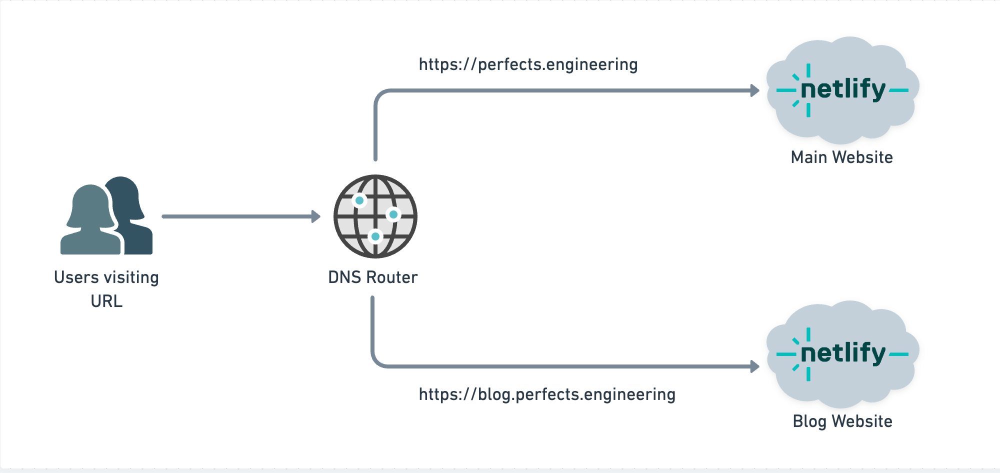
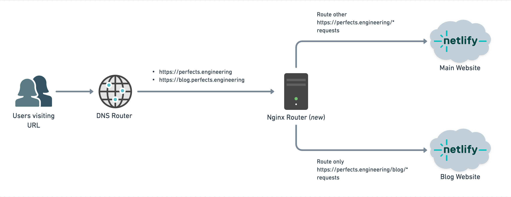

Recently, I decided to make a significant change to my website structure: I moved my blog from a subdomain (`https://blog.perfects.engineering`) to a subpath (`https://perfects.engineering/blog`), where you are reading this article now. 
In this article, I'll share why I made this decision and the technical steps I took to implement it.

## Why Make the Move?

My blog at `blog.perfects.engineering` has been gaining traction, attracting a good amount of traffic per month. However, my main website, `perfects.engineering` was seeing a lower level of engagement. With plans to launch additional content in the future, I wanted to consolidate everything under the same top-level domain. This move would allow me to:

1. Centralize my content
2. Improve overall domain authority
3. Simplify future content expansion

## The Migration Process

### Step 1: Planning the Move

Before diving into the technical details, I had to plan the migration carefully to minimize downtime on any of the two sites. My setup was as follows:

- Main website: Static HTML, CSS, and JavaScript.
- Blog: Gatsby-powered static site.
- Hosting: Both sites deployed on Netlify

> Also, the code for both my sites and blog is open source. You can find them on my <a href="https://github.com/perfectsengineering" target="_blank">Contents Github Repository</a>

The setup at the time can be visualized as:

The website and blog domains were reachable directly via the configured DNS Records.

To set up the `/blog` subpath routing on the main domain, I would need to add an application layer routing to redirect requests to the main domain.

I'll also update the DNS records to point to this router both the top-level domain (`perfects.engineering`) and the blog subdomain. I need to have `blog.perfects.engineering` pointed to the router because I must permanently redirect all existing paths on that domain to the new `https://perfects.engineering/blog` subpath.

I chose Nginx as the Router for this purpose because I'm familiar with it, and I already have a powerful proxy server setup that uses It to route some other projects I'm managing.
### Step 2: Configuring Nginx to Proxy Requests to Netlify

The core of this migration involved setting up Nginx to handle the routing. The router needs to do the following things:

**On the `perfects.engineering` Domain:**
1. Proxy any requests with a `/blog` path prefix to the Blog Netlify App.
2. Proxy all other requests to the Main Website Netlify App.

**On the `blog.perfects.engineering` Subdomain:**
1. Redirect all request paths to `https://perfects.engineering/blog/<<path>>`with a 301 status code (permanent redirect).

Here is the configuration I used:
```nginx
# setup custom routing for perfects.engineering
server {
	server_name perfects.engineering;

	# Proxy for /blog subpaths
	location /blog/ {
		proxy_pass https://pe-blog-app.netlify.app/blog/;
		proxy_set_header Host pe-blog-app.netlify.app;
		proxy_set_header X-Real-IP $remote_addr;
		proxy_set_header X-Forwarded-For $proxy_add_x_forwarded_for;
		proxy_set_header X-Forwarded-Proto $scheme;
	}


	# Default location for all other paths
	location / {
		proxy_pass https://pe-website-app.netlify.app/;
		proxy_set_header Host pe-website-app.netlify.app;
		proxy_set_header X-Real-IP $remote_addr;
		proxy_set_header X-Forwarded-For $proxy_add_x_forwarded_for;
		proxy_set_header X-Forwarded-Proto $scheme;
	}
}

# setup redirect routing for blog.perfects.engineering
server {
	server_name blog.perfects.engineering;

	# Redirect blog.perfects.engineering/$path to perfects.engineering/blog/$path
	location / {
		rewrite ^/(.*)$ $scheme://perfects.engineering/blog/$1 permanent;
	}
}
```

### Step 3: Handling Gatsby's Routing

Initially, I tried to use only URL rewrites to redirect requests to the `/blog` subpath. However, I encountered 404 errors because either Gatsby or Netlify was redirecting back to the base URL of the domain.


Next, I need to update Gatsby to support loading content on the `/blog` subpath. Luckily this was easily supported by Gatsby using the `PREFIX_PATHS` flag. This ensures that Gatsby builds all its content on the `/blog/` path. To do this, you need to update `gatsby-config.js` file:

```javascript
// In gatsby-config.js
module.exports = {
  pathPrefix: `/blog`,
  // ... other configurations
}
```

And then update your build command:

```bash
gatsby build --prefix-paths
```

In my case, I updated the build command of my Netlify project.

This change allowed me to route the paths to the domain without any additional URL manipulation.

#### Why I have to use path prefixes in my blog too
I initially attempted to use Nginx routing without modifying my blog's content. The plan was to route `https://perfects.engineering/blog/*` requests to `https://pe-blog-app.netlify.app/*`. However, this approach presented unexpected challenges.

The major issue I encountered was unexpected path rewrites. So, for example, if the browser visited https://perfects.engineering/blog/postgres_and_null, Nginx would proxy the request to `https://pe-blog-app.netlify.app/postgres_and_null`. However, upon loading, the browser URL would inexplicably rewrite to `https://perfects.engineering/postgres_and_null`, omitting the crucial `/blog` path. 

I inspected the browser network requests, and this rewrite wasn't an HTTP Redirect, suggesting a client-side script was responsible. Depending on when the rewrite happened, this led to intermittent 404 errors and asset loading failures (CSS, JS, Fonts, etc.). I turned off all the configs that could be responsible for this in Netlify (their Pretty URL feature) and Gatsby, but the behavior didn't change. After a while of trying to debug this, I decided to find another approach. 

After extensive debugging, I opted for a different approach: modifying the blog to serve content from the `/blog` path. This ensures any redirect or rewrite includes the `/blog` path, aligning with our desired URL structure.

**Note**: Local Gatsby builds didn't exhibit this behavior, so I suspect it might be Netlify-specific. If you have insights into what I might have overlooked, please share in the comments!

### Step 4: Testing and Deployment

Before going live, I thoroughly tested the new config to ensure:

1. All existing blog posts were accessible at their new URLs
2. Internal links within the blog were updated to the new structure
3. The main website and blog coexisted without conflicts

I tested this by running the Nginx config on my laptop and then updating my `/etc/hosts` file to point all requests to `perfects.engineering` and `blog.perfects.engineering` to my localhost (`127.0.0.1`). This way I was able to test all the routing logic on my local with a faster feedback loop.

Once testing was complete, I deployed the changes and monitored the site for any issues.
To ensure a smooth transition with minimal to zero downtime, I implemented the following deployment strategy:

1. **Deploy New Blog Instance**: Due to the addition of the `--prefix-paths` flag in the build command, I deployed a new instance of the blog on Netlify. This new instance serves content from the `/blog` path.
2. **Update Nginx to Point to New Blog**: Modified the Nginx configuration to direct traffic to the newly deployed blog instance.
3. **DNS Update**: Changed DNS records for both the main domain and subdomain to point to the routing servers.
4. **Maintain Old Blog**: Kept the original `blog.perfects.engineering` (without `/blog` prefix) accessible during DNS propagation.

This approach ensured that the old blog remained accessible while DNS changes propagated, providing a seamless transition for users. The new routing logic gradually took effect as DNS updates spread, directing traffic to the new blog structure without interruption.
## Conclusion

Moving my blog from a subdomain to a subpath was a strategic decision to consolidate my online presence. While it presented some technical challenges, particularly with routing and Gatsby configuration, the result is a more cohesive and user-friendly website structure.

One potential consequence of this setup is that some visitors to my site may experience slower load times. This is because I’m now routing from a single server located in Europe, which means I may miss out on some of the speed boosts provided by Netlify's content delivery network (CDN) if the requests were sent directly from the client to Netlify. However, any slowdown should be minimal as I mainly serve static content. Additionally, I use Cloudflare for DNS routing, which has static content caching enabled on its edge servers.

This migration sets the stage for future content expansion and should improve SEO performance across my entire domain. If you're considering a similar move, remember to plan carefully, test thoroughly, and be prepared to explore the intricacies of your web server and static site generator configurations.

Happy coding, and may your websites always return 200 OK!