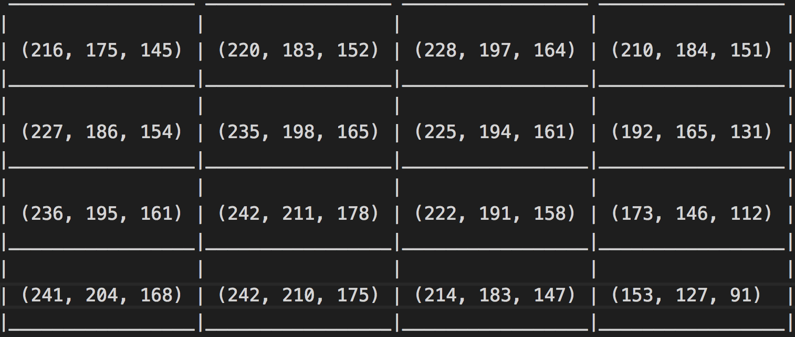
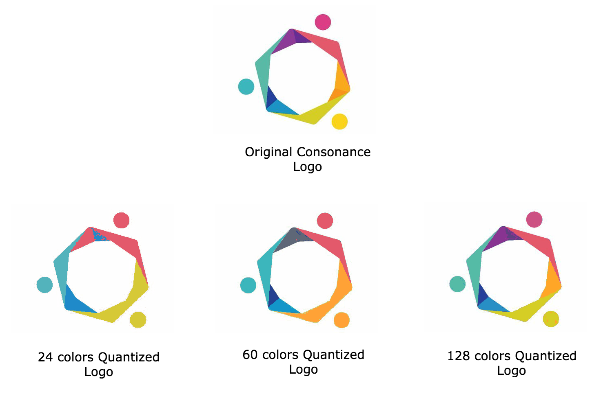

> This is the second part of a two part tutorial series. If you are yet to read the first part, I recommend you start from [there](../k_means_and_image_quantization_1).

In [part 1](../k_means_and_image_quantization_1), I explained what K Means is all about and highlighted the basic algorithm to perform K Means clustering. In this part, I’m going to show a practical example of K Means application in the real world. This application would be Image Quantization on Color Images. This is usually referred to as Color Image Quantization or just Color Quantization.

## First, a quick history on Color Image Quantization


Color quantization is one of the most frequently used operations in computer graphics and image processing. In the early days of computing, video graphics adapters had a restriction on the number of colors that they could display per pixel. Unlike these days where displays can display 24 bits per pixel (8 bits for each of Red, Green and Blue), video cards could only support 4 or 8 bits color per pixel. This restriction was majorly as a result of memory limitation on the video adapter produced in those days.

As a result of this limitation, there was a need to display normal 24 bits digital color images on such 4 or 8 bits color displays. Color quantization made it possible to display these images on these devices with fewer colors with little visual degradation to the final image.

However, these days where 24 bits graphics hardware has become ubiquitous, color quantization still maintains it importance. Color quantization is used as a lossy compression technique where a full colored image is mapped to a smaller set of colors. It is called lossy because some color information would be lost from the original image.

So with Color quantization, you are able to reduce the space required for storing images and also reduce transmission bandwidth required in multimedia applications.

### Here is how it works


Generally, color quantization is usually treated as some sort of clustering problem where each of the color pixels will be grouped into clusters and each cluster will then be represented as a unique color in the new image. There are many techniques to perform color quantization on a image, but this tutorial is going to explain how it is done using K Means.

Let us consider the 4x4 pixel image below for color quantization:


Each of the square section represents a color pixel. These pixel colors are usually represented as a combination of 8 bits Red (R), Green (G) and Blue (B) value. So the above 4 by 4 pixel image can be displayed as an array of (R, G, B) vectors as shown below:




**NOTE:** The range of integer values for 8 bits is 0 - 255. So the Red, Green and Blue values will always be within that range.

Using the step by step guide for calculating K Means that I highlighted in the first part of this series, we can perform color quantization like this:

**1. Identify the number of clusters you need — ‘K’s value.**

The K value for color quantization is the number of colors that we desire to represent the image. For example in the case of the above 4x4 image, let’s say we want to represent the same image with only 5 colors, then our K value will be 5.

Note that the K value should be less than the actual number of pixels that exist in the image.

**2. Select ‘K’ points (centers) within the range of the items in the list.**

Now that you have known your ‘K’ value, next step is to select ‘K’ colors within the range of values of colors that are used to represent the original image. These selected colors would act as the center colors for classifying all the colors in the original image.

There are many techniques used to determine which points to select as the center. These techniques actually take an iterative approach to determining the best ‘K’ centers to use, but for simplicity it is safe to say that randomly selecting any ‘K’ colors within the original image would suffice to act as a viable center.

**3. Calculate distances of all items to each ‘K’ center.**

Next, we need to determine a way of calculating how similar each of the pixel colors in the original image are to each of our selected ‘K’ center colors. Confused? Take a deep breath and read that sentence again 🙂.

Since each color is represented as a RGB vector value, we can use the euclidean distance to calculate the distance between two colors.


For example, lets assume our ‘K’ value is 3 (from step 1) and the three center colors randomly selected are C1, C2 and C3 where:

```
C1 = (220, 183, 152)
C2 = (242, 211, 178)
C3 = (173, 146, 112)
```

To calculate the distances between these center colors and a specific color **C = (216, 175, 145)**, we can apply the euclidean distance as shown in the image below:


D1 is the distance between center color **C1 (220, 183, 152)** and the color **C (216, 175, 145)**, while D2 and D3 are the respective distances of the same color C to **C2** and **C3**.

So in this step, you use the euclidean distance function to calculate distances between all the pixel colors and each of the selected ‘K’ centers. The calculated distances will be used in the next step to classify each the pixel colors.

**4. Classify each items to a center with the shortest distance**

This step is the crux of color quantization. In this step, you run through each pixel of the original image and replace it with the center color that has a closest distance to it. In color quantization, this step is known as color remapping.

So from our example in step 3 above, we can see that the distance D1 is smaller than D2 and D3, therefore we would replace that color C with the C1 center color in the original image.

This remapping process would then create an image that is similar to the original image, but only with ‘K’ colors.




### Quick implementation in Javascript (Node.js)
In the first part of this post, I asked readers to vote on which programming language I should use to implement image quantization and there was a tie between Javascript and Python. I decided to use Javascript because there are fewer sample implementations of image quantization in Javascript than Python.

Before I begin with the implementation, I won’t be showing the specifics of how to load and extract colors from an image as there are many ways this can be achieved. In this post, I’ll focus more on the quantization process for the colors in the image. You can see a complete implementation which contains all the image loading and saving code [here](https://github.com/perfectmak/ImageQuantizationUsingJS).

Let’s start by defining a `quantize()` function that accepts two arguments, first argument will be the k centers we are interested in and the second would be the array of [R, G, B] arrays for each pixel colors that are in an image.

```javascript
function quantize(k, colors) {
    if (k > colors.length) {
        throw Error(`K (${k}) is greater than colors (${colors.length}).`)
    }
  ...
}
```

We check to ensure that the ‘K’ centers needed are not greater than the number of colors in the image.

Next we need to select the ‘K’ centers from the initial color. These will be the centers we would use for quantization. So lets implement a function `getRandomKCenters()` that does that this and use it inside our `quantize()` function as show below:

```javascript
function getRandomKCenters(k, colors) {
    return lodash.sampleSize(colors, k);
}

function quantize(k, colors) {
  ...
    const centers = getRandomKCenters(k, colors)
  ...
}
```


For simplicity, `getRandomKCenters()` in this case just uses lodash’s [`sampleSize()`](https://lodash.com/docs#sample) function to select the center colors from the colors array, but you can use a more complex algorithm to get your centers.

Next, we need to calculate the distance of each color in the array to the selected centers and re-map the closest center to that color. Let’s take a look at the code for this:

```javascript
function quantize(k, colors) {
  ...
  
  const centerDistances = new Array(k)
  for(let i = 0; i < colors.length; i++) {
      for(let j = 0; j < centers.length; j++) {
          centerDistances[j] = distance(centers[j],  colors[i])
      }
      const minimumDistance = Math.min(...centerDistances)
      const closestCentersIndex = centerDistances.indexOf(minimumDistance)
      colors[i] = centers[closestCentersIndex]
  }
  ...
}
```


First, a `centerDistances` array is initialized to hold the distances of a particular color to each center. Then we loop through each color and for each of those colors, we calculate the distances between each center and that color. The calculated distances are stored in the `centerDistances` array. After calculating the distances, we find the center with the minimum distance and assign (re-map) that center to the original color at that position.

The `distance()` function calculates the euclidean distance between two colors of RGB values. Below is its implementation:

```javascript
function distance(color1, color2) {
    const [ r1, g1, b1 ] = color1
    const [ r2, g2, b2 ] = color2
    return Math.sqrt(
        Math.pow(r1 - r2, 2) + Math.pow(g1 - g2, 2) + Math.pow(b1 - b2, 2)
    )
}
```


Then lastly we return the re-mapped color array from the `quantize()` function. The final `quantize()` function now looks like this:

```javascript
function quantize(k, colors) {
    if (k > colors.length) {
        throw Error(`K (${k}) is greater than colors (${colors.length}).`)
    }

    const centers = getRandomKCenters(k, colors)

    let centerDistances = []
    for(let i = 0; i < colors.length; i++) {
        for(let j = 0; j < centers.length; j++) {
            centerDistances.push(distance(centers[j],  colors[i]))
        }
        const minimumDistance = Math.min(...centerDistances)
        const nearestCentroidForI = centerDistances.indexOf(Math.min(...centerDistances))
        colors[i] = centers[nearestCentroidForI]
        
        centerDistances.length = 0 // clear distance array
    }

    return colors
}
```


So that is how you perform color quantization on an image using Nodejs. You can check [here to see the full code](https://github.com/perfectmak/ImageQuantizationUsingJS). You can also clone and test it out locally.

<hr/>

Some things to note:

1. This sample code greatly simplifies things by representing images in the RGB space. There are other formats of representing image colors which are even closer to how humans perceive color and will provide even better results when K Means is applied to them. Although, it is quite easy to extend the current implementation to handle other color spaces.
2. K Means itself is an optimization algorithm and takes a long time to perform its clustering. So if applied on a very large image, it will take a longer time before producing an optimal result. You should try testing it out with smaller images first to get results quickly.

<hr/>

Some of you might ask how representing an image with fewer colors will really help with compression, because it is still the same number of pixels even though each pixel is now represented with a fewer number of colors. Well, image formats such as PNG employ some techniques that use the feature of [multiple repeating values for compression](https://medium.com/@duhroach/how-png-works-f1174e3cc7b7).

In this post, I have discussed a practical application of K Means for Image Quantization and also showed how this can be implemented in Javascript. If you have any question or suggestions on how this can be improved, please drop your comments below.

Don’t forget to share this post with your friends.

<hr/>

Special Thanks to [Wumi Oyediran](https://twitter.com/wumi_oyediran), [Oyewale Ademola](https://twitter.com/sao_ademola) and [Ohans Emmanuel](https://medium.com/@ohansemmanuel) for helping me review this posts.